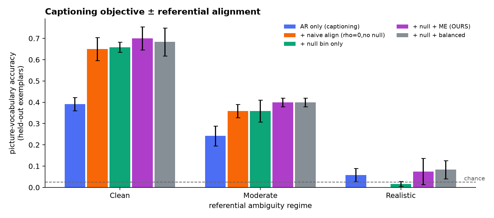

# GAVAGAI

**Referential alignment for infant-scale vision–language models**, targeting the
[BabyVLM Workshop @ NeurIPS 2026](https://babyvlm.github.io/#cfp) (deadline 8 Sep 2026, ≤8 pages, non-archival).

Named for Quine's *gavagai*: a caregiver's utterance and the scene in front of an
infant are a bag of words and a bag of things with unknown correspondence.

---

## The starting observation

BabyVLM-V2's from-scratch 1.1B "baby model" shows a sharp dissociation on **DevCV Toolbox**:

| near-ceiling | | near-chance | |
|---|---|---|---|
| Left/Right | 96.4 | Picture Vocabulary | 32.4 (chance 25) |
| Spatial Details | 92.8 | Localization | 37.8 (chance 25) |
| Who-Has-More (synth) | 99.7 | VDR-binary | 54.6 (chance 50) |

It looks like a model with excellent perception and no word knowledge. **Part of that
turns out to be an artefact of what the tasks measure.**

## Finding 1 — two DevCV tasks do not measure what they appear to

Three baselines that never read the prompt, run against the **public Ego4D release**
(~6,200 scorable items). `scripts/text_blind_audit.py`.

| task | n | chance | position | dup-file | image-match |
|---|---|---|---|---|---|
| **spatialdetails** | 1852 | 0.33 | 0.34 | **1.00** [1.00, 1.00] | **1.00** [1.00, 1.00] |
| **leftright** | 1009 | 0.33 | 0.35 | *all options identical to query* | 0.32 (= chance) |
| picture_vocabulary | 346 | 0.25 | 0.27 | n/a | n/a |
| localize | 992 | 0.25 | 0.30 | n/a | n/a |
| compare_real / synthetic | 939 / 1049 | 0.50 | 0.51 / 0.50 | n/a | n/a |

**Spatial Details is solvable without perception.** In 1852/1852 items the gold option is a
*byte-identical copy of the query image*. Comparing filenames scores 1.00. Gold letters are
balanced (A:631 B:605 C:616), so the duplicate moves with the answer — not a position artefact.

**Left/Right is unanswerable from the released files.** In 1009/1009 items the query and all
three options are the same path. Any distinguishing transform must be applied by the eval
harness at runtime, so nobody working from the public release can reproduce that task.

**The controls hold.** Picture Vocabulary resists every baseline — its query is a *word*.
Answer positions are at chance everywhere. These baselines win exactly where the data hands
them the answer, and nowhere else.

> **Verified twice.** `scripts/verify_dup_finding.py` re-derives both numbers from the raw JSON
> using only the standard library, sharing no code with the audit, and reproduces 1852/1852 and
> 1009/1009 exactly.
>
> **Boundary:** measured on the public **Ego4D** variant. BabyVLM-V2's published 96.4 / 92.8 are
> on the gated **SAYCam** variant. Same pipeline, so worth checking — but no claim is made about
> those numbers.

## Finding 2 — the residual gap is real, and it is about referential binding

The tasks that survive the audit (Picture Vocabulary, Localization) are exactly those
requiring a word→referent mapping. Every training stage of the baby model is **LLaVA-style
next-token prediction**: there is no contrastive term, no batch-level marginal correction,
and no latent word↔region variable. Utterance perplexity can be driven down from global
gist plus language priors without ever binding a word to a thing.

## Proposed fix — cross-situational grounding as balanced optimal transport

A cheap auxiliary loss adding the missing latent variable. Per episode, solve a
semi-relaxed entropic OT problem between content words and object slots, with

* a **null bin**, so a word may refer to nothing visible (most caregiver tokens do not); and
* a **column marginal constraint** = mutual exclusivity, which makes hub collapse *infeasible*
  rather than merely disfavoured.

Two knobs generate the whole family — `ρ = 0` provably reduces to the row-wise softmax of
standard region–word contrastive learning, so every ablation changes one scalar rather than
swapping code paths. See [`METHOD.md`](METHOD.md) for the derivation and propositions.

### Measured (controlled simulation, 3 seeds, chance = 0.025)

Picture-vocabulary accuracy on **held-out exemplars** of each category, across three
referential-ambiguity regimes. Full numbers in [`RESULTS.md`](RESULTS.md).

| condition | clean | moderate | realistic |
|---|---|---|---|
| AR only (captioning) | 0.392 | 0.242 | 0.058 |
| + naive align (`ρ=0`, no null) | 0.650 | 0.358 | **0.000** |
| + null bin only | 0.658 | 0.358 | 0.017 |
| + null + ME (**ours**) | **0.700** | **0.400** | 0.075 |



The captioning objective alone is weakest in every regime. Under realistic ambiguity the
*naive* form of the alignment collapses to **0.000 with zero variance across all three
seeds** — total hub collapse, worse than adding nothing. The null bin and the exclusivity
constraint are what prevent it.

**Against us:** the realistic regime is floor-limited at this budget, so its dispersion
exceeds the gap between the conditions that work. The meaningful separation is in the clean
and moderate regimes.

### A claim we retracted

An earlier version of this work reported that the exclusivity constraint gave no benefit in
the contrastive setting. That measurement was taken on a simulator where each object had a
single fixed appearance — so the task was not category learning, every condition scored
1.000, and the comparison was vacuous. With multiple exemplars per object and held-out
evaluation, sweeping `ρ` at a fixed 1000-episode corpus gives 0.275 (ρ=0) → **0.383**
(ρ=0.1) → 0.350 (balanced), with the hub rate roughly halving from 0.050 to 0.025 between the
endpoints (not monotone in between, and noisy at 3 seeds).

The optimum is *interior*: full mutual exclusivity over-constrains, because real scenes do
contain several plausible referents. See [`METHOD.md`](METHOD.md) §6.2b.

---

## Layout

```
gavagai/
  ot.py         log-domain semi-relaxed Sinkhorn with a null bin
  losses.py     E-step / M-step objective + hub-collapse diagnostic
  lexicon.py    persistent word x concept lexicon with PMI feedback
  sim.py        controlled cross-situational world; contrastive + AR learners
  models.py     ViT-S/16 grounding model + caption decoder, from scratch
                (16.8M encoder / 22.3M with decoder; T4-sized)
  data/devcv.py DevCV-Toolbox loader + zero-shot PV / localization evaluators
scripts/
  text_blind_audit.py   benchmark audit (Finding 1)
  run_simulation.py     controlled experiments
tests/          executable checks for every proposition in METHOD.md
```

## Running on Kaggle

The evaluation data is on **Hugging Face, not Kaggle** — do not use the "Add Data"
sidebar. Open `notebooks/kaggle_gavagai.ipynb` and set:

| Setting | Value |
|---|---|
| Accelerator | GPU T4 ×2 — *only needed for Section 5* |
| Internet | **ON** (required for the download; Kaggle needs a phone-verified account) |

Sections 1–4 (including the benchmark audit) need **no GPU at all** — run them in a
CPU-only session and keep your 30 GPU-h/week for training. The datasets:

| Purpose | Hugging Face repo |
|---|---|
| Evaluation (the audit) | `wsashawn/devcv_toolbox_ego4d` |
| Instruction tuning (optional) | `wsashawn/babyllava_v2_instruction_ft_Ego4D` |
| Official checkpoints (optional) | `wsashawn/babyllava_v2_{vision_backbone,phase2,instruction_ft}` |
| Training corpus | none — `--data synthetic` needs no download |

SAYCam and BabyView are Databrary-gated and are not required for anything here.

## Quickstart

```bash
pip install -r requirements.txt
python -m pytest tests/ -q

# Finding 1, on the full public Ego4D release
hf download wsashawn/devcv_toolbox_ego4d --repo-type dataset --local-dir data/Ego4D
python scripts/text_blind_audit.py --roots data/Ego4D

# Controlled experiments (CPU, minutes)
python scripts/run_simulation.py efficiency
python scripts/run_simulation.py rho
```

## Data

SAYCam and BabyView are Databrary-gated. Every number here is reproducible from the
**public Ego4D variants** released by the BabyVLM-V2 authors:
`wsashawn/devcv_toolbox_ego4d`, `wsashawn/babyllava_v2_instruction_ft_Ego4D`, and the
phase-0/2/3 checkpoints. A SAYCam adapter is included but is not on the critical path.
